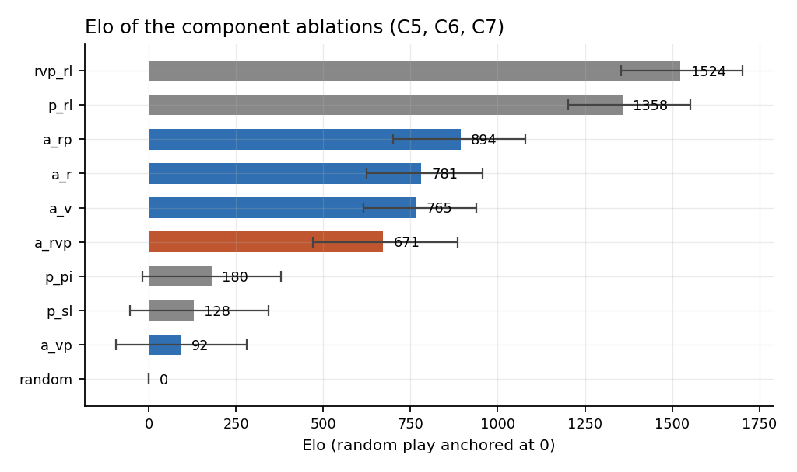

# AlphaGo from scratch

A from-scratch reproduction of **Silver et al. 2016, *Mastering the game of Go
with deep neural networks and tree search*** (Nature **529**, 484–489), resized
from 19×19 to 9×9 so that the entire four-stage pipeline runs on two T4s.

Everything is built here. No Go library, no RL library, no MCTS library:

| | |
|---|---|
| `ag/go.py` | Go rules: chains, liberties, captures, suicide, simple ko, eyes, Tromp-Taylor area scoring — in numba |
| `ag/features.py` | the 48 input planes of Extended Data Table 2 (46 here — see deviations) |
| `ag/rollout.py` | the fast rollout policy `p_π`, with incrementally-updated 3×3 patterns |
| `ag/nets.py` | the policy and value networks of the Methods section, per-position output bias included |
| `ag/mcts.py` | APV-MCTS: PUCT selection, dual leaf evaluation, λ-mixed backup |
| `ag/selfplay.py` | batched self-play, so a network sees one large forward pass per move rather than thousands of tiny ones |
| `ag/arena.py` | paired-colour matches, Agresti–Coull intervals, logistic Elo with bootstrap CIs |

## Result

Seven claims, written down before the code. **Two confirmed, four refuted, one
split** — full numbers and reasoning in [REPORT.md](REPORT.md).

| | claim | verdict |
|---|---|---|
| C1 | accuracy → strength | refuted (Spearman −0.04, axes verified to have range) |
| C2 | RL self-play beats SL | **confirmed** (100/100; paper says >80%) |
| C3 | whole-game value data overfits | **confirmed, more starkly than the paper** |
| C4 | value net beats 100 rollouts | refuted (it loses to *uniform random* rollouts) |
| C5 | λ=0.5 beats λ=0 and λ=1 | half — beats λ=0, loses to λ=1 |
| C6 | SL is a better prior than RL | refuted (RL is better at both) |
| C7 | raw net ≈ thousands of rollouts | refuted for p_σ, **confirmed for p_ρ** |

Three of the four refutations trace to one fact: a 9×9 game ends in ~100 moves,
so a rollout is nearly an exact evaluation, and the value network — the thing
AlphaGo introduced to replace noisy rollouts — has nothing left to improve on.
That is the resize talking, not the paper. What survives it is everything about
learning from self-play, and the largest single effect measured anywhere here is
policy-gradient RL taking one forward pass from "loses to 50 rollouts" to "even
with 1,000" at unchanged inference cost.



## The point

Not "get a strong 9×9 bot". The point is to state the paper's claims so they
could fail, build the smallest honest apparatus that could falsify them, and
report what happens — including the places the *measurement* turned out to be
the fragile part.

* **[CLAIMS.md](CLAIMS.md)** — seven falsifiable claims, written down before any
  code, each with the number that would confirm it.
* **[REPORT.md](REPORT.md)** — results, the full deviations table, and a "what
  broke" section.

## Reading the code

Every source file carries a **comment rail**: the code on the left, a flowing
plain-English explanation down a `# |` column on the right, explaining *why*
each piece has to be the way it is rather than restating what the line says.

```
@njit(cache=True, inline="always")                        # +-- REPAIRING CODES AFTER A MOVE ---------------
def patch_pat(board, surr, pat, q):                       # | When the colour at one point changes, the only
    d = _digit(board[q])                                  # | codes that become wrong are those of its eight
    for k in range(8):                                    # | ring neighbours, because those are exactly the
        r = surr[q, k]                                    # | points that have it in their own ring. Each of
        if r < 0:                                         # | those codes is wrong in exactly one digit, and
            continue                                      # | the antisymmetry of the ring ordering says
        pw = POW4[7 - k]                                  # | which one ...
```

Every file in `ag/` carries one: `go.py`, `rollout.py`, `mcts.py`,
`features.py`, `nets.py`, `selfplay.py`, `arena.py`, `players.py`, `data.py`.

## Tests

46 tests, and the ones worth knowing about are not the shape checks:

```bash
python tests/test_go.py        # captures, ko and its expiry, suicide-that-captures, area scoring
python tests/test_features.py  # features(rotate(s)) == rotate(features(s)) for all 8 symmetries
python tests/test_nets.py      # the symmetry ensemble must COMMUTE with the symmetry
python tests/test_mcts.py      # the value sign chain, for black AND for white
python tests/test_cache.py     # three processes racing on one feature cache
```

Each of those last two files exists because of a bug that shipped:

* the flood fill's visited-array was `int32` while its tag counter was `int64`,
  so past 2³¹ the marker silently truncated and the fill ran off the end of its
  buffer into the heap — killing four workers 35 minutes in. Every test passed
  beforehand; none ran long enough to reach 2³¹.
* the shared feature cache was readable while half-written, so two of three
  policy networks spent an entire run measuring their accuracy against blank
  boards. They reported 1.4%. Their weights were fine. That one was written up
  as a step-size collapse first, and the write-up was wrong — see
  [REPORT.md](REPORT.md#what-broke).

The recurring theme: every one of those failures produces a program that still
runs, still returns legal moves, and merely plays *slightly worse* — or reports
a number that looks like a plausible result. Which is indistinguishable from
"the network is weak", and would otherwise never be found.

## Running it

```bash
pip install -r requirements.txt
```

```
gen_expert.py        teacher games (MCTS with rollouts, no network)
   ↓
train_rollout.py     fit p_π by softmax regression on the teacher's moves
train_sl.py          the SL policy network p_σ                        [C1]
   ↓
check_eval.py        THE GATE — measures the accuracy ceiling, the MSE floor,
                     the Elo bracket and the degenerate shortcuts, and refuses
                     the sweep if any of them is too narrow to measure in
   ↓
train_rl.py          REINFORCE self-play against a pool of past selves   [C2]
gen_value_data.py    one position per game, three-phase generation
train_value.py       the value network, both data schemes               [C3]
   ↓
tournament.py                 round robin over the ablation rows       [C5 C6]
eval_value_vs_rollouts.py     Fig 2b                                     [C4]
eval_c7_search_free.py        one forward pass against a search ladder    [C7]
eval_c1_strength.py           Fig 2a                                     [C1]
make_figures.py
```

One command, dependency-ordered across two GPUs and resumable — every stage
skips if its outputs already exist:

```bash
python scripts/gen_expert.py --games 160 --sims 128 --seed 2000 \
       --out data/expert_0.npz             # ×4, one per core, ~23 min
python scripts/run_pipeline.py --data data --runs runs --value-games 36000
```

~2 hours on 2×T4 after the data. Then watch it play, with the search's
reasoning printed:

```bash
python scripts/demo.py --runs runs --black rvp_rl --white a_r
```

Board size and komi come from the environment (`AG_BOARD_SIZE`, `AG_KOMI`), so
the whole pipeline re-runs at 7×7 without editing anything.

The figures above and in the report are regenerated from the result JSONs
alone — no checkpoint required:

```bash
python scripts/make_figures.py --runs results/run2 --out figures
```

## What this is not

It is not AlphaGo. The supervised teacher here is a Monte-Carlo tree search
program, not 160,000 games by 6–9 dan humans, so the entire ladder is anchored
lower and absolute strength is not comparable to the paper's. Every claim under
test is a *relative* comparison, which is why they survive the substitution —
and saying so plainly is part of the job.
